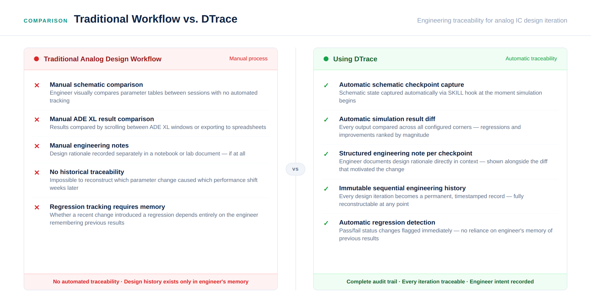
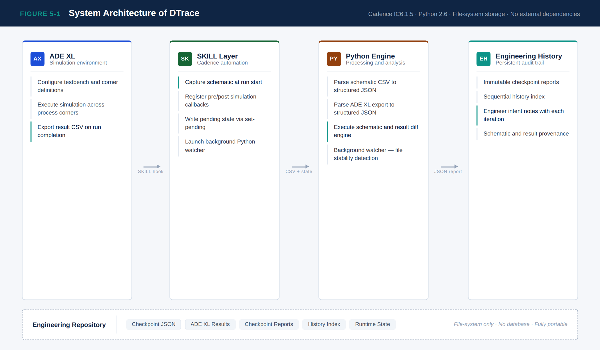
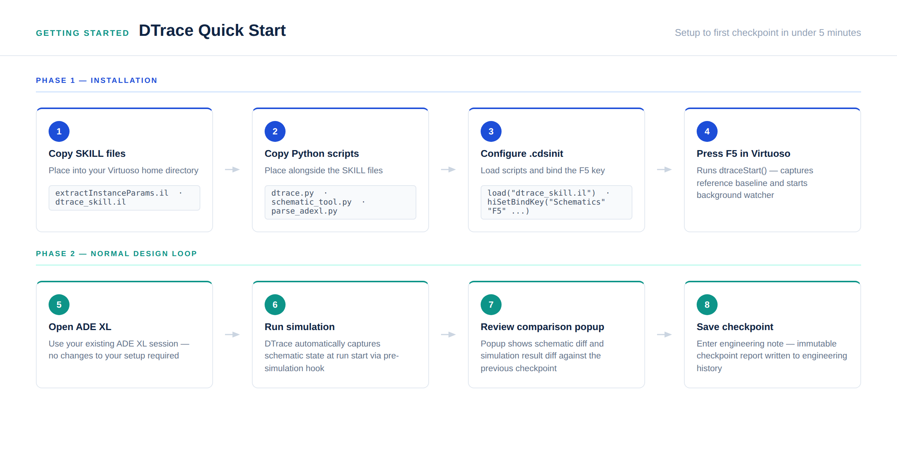
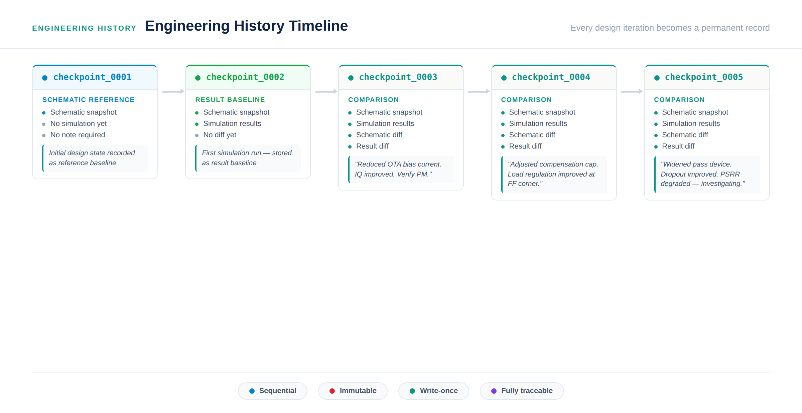
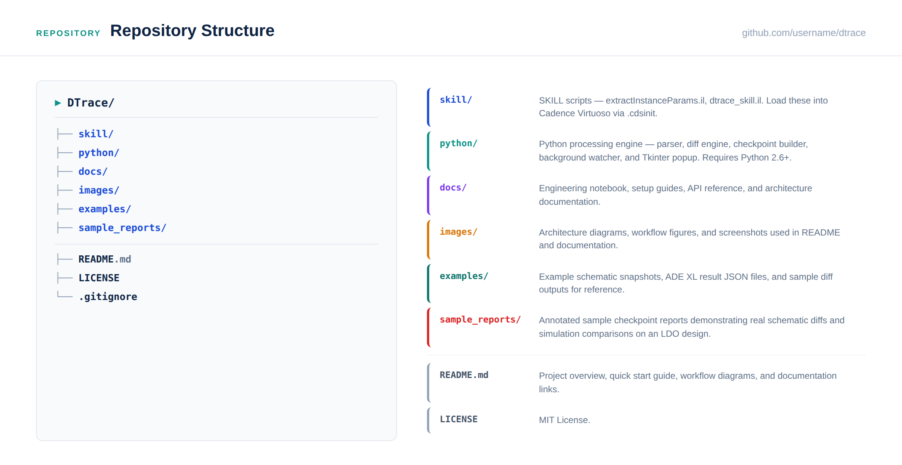

# DTrace


<p align="center">
  
  
  
  
  
  
</p>

**DTrace** is an engineering traceability framework for analog IC design workflows in **Cadence Virtuoso ADE XL**.

It automatically captures schematic checkpoints, ADE XL setup variables, simulation results, result differences, schematic differences, and designer notes so that every design iteration becomes a permanent engineering record.

DTrace was built around one simple idea:

> **Historian, not advisor.**
> DTrace records what changed and preserves engineering intent. It does not decide what the designer should change.

---

## Contents

* [Why DTrace Exists](#why-dtrace-exists)
* [What DTrace Does](#what-dtrace-does)
* [What DTrace Records](#what-dtrace-records)
* [System Architecture](#system-architecture)
* [Workflow](#workflow)
* [Generated Artifacts](#generated-artifacts)
* [Example Checkpoint Report](#example-checkpoint-report)
* [Repository Structure](#repository-structure)
* [Technology Stack](#technology-stack)
* [Installation Overview](#installation-overview)
* [Usage Overview](#usage-overview)
* [Design Philosophy](#design-philosophy)
* [Current Scope and Limitations](#current-scope-and-limitations)
* [License](#license)
* [Author](#author)

---

## Why DTrace Exists

Analog design is highly iterative.

During circuit development, a designer may change:

* transistor width
* transistor length
* finger count
* multiplier
* bias current
* compensation capacitance
* zeroing resistor
* load current
* ADE XL design variables
* corner setup
* measurement expressions

Cadence Virtuoso and ADE XL store the current design state and simulation results, but they do not automatically preserve the full engineering story behind each iteration.

After many simulation runs, it becomes difficult to answer questions like:

* What exactly changed between two runs?
* Which schematic parameters were modified?
* Which ADE XL variables changed?
* Which metric improved?
* Which metric regressed?
* Which corner became the worst case?
* Why did the designer make that change?

DTrace addresses this traceability gap.

It does not replace Virtuoso, Spectre, or ADE XL. It adds a lightweight engineering history layer on top of the normal analog design workflow.



---

## What DTrace Does

DTrace connects three parts of the analog design workflow:

1. **Cadence Virtuoso schematic state**
2. **ADE XL simulation setup and exported results**
3. **Designer rationale**

For each engineering iteration, DTrace can:

* capture a schematic parameter snapshot
* export ADE XL result data
* capture ADE XL setup variables
* parse simulation results into structured JSON
* compare the current schematic against the previous checkpoint
* compare ADE XL variables across checkpoints
* compare simulation results across corners
* classify pass/fail transitions
* record designer notes
* generate immutable checkpoint reports
* maintain a project history index

The final output is not just a table of numbers. It is an engineering checkpoint that links **what changed**, **what happened**, and **why the change was made**.

---

## What DTrace Records

A DTrace checkpoint can preserve:

| Category           | Captured Information                                            |
| ------------------ | --------------------------------------------------------------- |
| Schematic state    | Instance names, cell names, device parameters                   |
| ADE XL setup       | Design variables and simulation setup values                    |
| Simulation results | Nominal, min, max, pass/fail, and corner data                   |
| Schematic diff     | Added, removed, and modified instances                          |
| Setup diff         | Changed ADE XL variables                                        |
| Result diff        | Regressions, improvements, value changes, worst-corner movement |
| Designer note      | Short engineering rationale entered at checkpoint time          |
| Metadata           | Timestamp, checkpoint ID, previous/current run references       |

This makes it possible to reconstruct the design history later without relying on memory.

---

## System Architecture

DTrace is split into two main layers:

* **SKILL layer**

  * runs inside Cadence Virtuoso
  * captures schematic data
  * interacts with ADE XL
  * exports result data
  * invokes Python processing

* **Python layer**

  * parses schematic CSV snapshots
  * parses ADE XL result CSV files
  * compares checkpoints
  * generates JSON reports
  * maintains checkpoint history



---

## Workflow

The intended workflow is event-driven.

DTrace is triggered from the designer's existing ADE XL session.

```text
Engineer modifies schematic
        │
        ▼
DTrace is triggered from ADE XL
        │
        ▼
SKILL captures schematic checkpoint
        │
        ▼
SKILL captures ADE XL setup variables
        │
        ▼
ADE XL simulation runs
        │
        ▼
ADE XL result table is exported
        │
        ▼
Python parses schematic and result data
        │
        ▼
DTrace compares against previous checkpoint
        │
        ▼
Designer records engineering note
        │
        ▼
Checkpoint report is saved
```



---

## Generated Artifacts

A normal DTrace run creates files similar to:

```text
design_tracker/
├── checkpoints/
│   ├── checkpoint_0007.csv
│   ├── checkpoint_0007.json
│   ├── checkpoint_0007_adexl_setup.json
│   └── checkpoint_0007_adexl_vars.raw
│
├── adexl_results/
│   ├── dtrace_results_0006.csv
│   └── adexl_results_006.json
│
├── reports/
│   └── checkpoint_0005_report.json
│
├── index.json
├── dtrace_state.json
└── dtrace.log
```

Each file has a specific role.

| File                               | Purpose                             |
| ---------------------------------- | ----------------------------------- |
| `checkpoint_XXXX.csv`              | Raw schematic parameter export      |
| `checkpoint_XXXX.json`             | Parsed schematic snapshot           |
| `checkpoint_XXXX_adexl_setup.json` | Parsed ADE XL variable snapshot     |
| `dtrace_results_XXXX.csv`          | Stored ADE XL result export         |
| `adexl_results_XXX.json`           | Parsed simulation result data       |
| `checkpoint_XXXX_report.json`      | Final engineering comparison report |
| `index.json`                       | Project checkpoint history          |
| `dtrace_state.json`                | Pending checkpoint state            |
| `dtrace.log`                       | Execution log                       |

---

## Example Checkpoint Report

DTrace checkpoint reports combine schematic changes, ADE XL setup changes, simulation result changes, and designer rationale.

An example report is provided here:

```text
sample_reports/sample_checkpoint_report.json
```

The sample report demonstrates:

* ADE XL setup variable change
* result comparison between two simulation runs
* regression detection
* improvement detection
* value-only changes
* unchanged metrics
* worst-corner tracking
* checkpoint metadata
* designer note

Example report structure:

```json
{
  "checkpoint": "0005",
  "type": "comparison",
  "created_at": "2026-06-25 13:23:20",
  "note": "Example engineering checkpoint",

  "schematic_diff": {
    "prev_checkpoint": 6,
    "curr_checkpoint": 7,
    "added": [],
    "removed": [],
    "modified": []
  },

  "adexl_setup_diff": {
    "changed": {
      "ILOAD": {
        "old": "1m",
        "new": "10m"
      }
    }
  },

  "adexl_diff": {
    "regressions": [],
    "improvements": [],
    "value_changes": [],
    "no_changes": []
  }
}
```

The complete sample report is intentionally stored as JSON so it can be inspected, parsed, or reused by other tools.

---

## Features


### Schematic Checkpoint Capture

DTrace extracts top-level schematic instance parameters using SKILL and stores them as CSV and JSON.

Captured fields include:

* instance name
* library name
* cell name
* view name
* parameter name
* parameter value

For MOS devices, common sizing parameters such as width, length, multiplier, finger width, and finger count are preserved.

---

### ADE XL Result Parsing

DTrace parses ADE XL exported result tables into structured JSON.

The parser captures:

* test name
* output name
* nominal value
* specification
* pass/fail status
* min and max values
* process corner
* temperature
* corner-specific values

A sample parsed result file is available at:

```text
examples/sample_adexl_results.json
```

---

### Simulation Result Diff

DTrace compares parsed ADE XL result JSON files across checkpoints.

It detects:

* regressions
* improvements
* value-only changes
* unchanged metrics
* new metrics
* removed metrics
* worst-corner movement

The comparison engine is intentionally metric-agnostic. It does not contain circuit-specific rules or analog design judgement.

---

### ADE XL Setup Diff

DTrace captures ADE XL variables and compares them across checkpoints.

This makes changes such as load current, bias values, or design variables visible in the final report.

Example:

```json
"adexl_setup_diff": {
  "changed": {
    "ILOAD": {
      "old": "1m",
      "new": "10m"
    }
  }
}
```

---

### Designer Notes

DTrace requires a short designer note when saving comparison checkpoints.

This is important because the numerical difference alone does not explain engineering intent.

A report should answer:

```text
What changed?
What happened?
Why was this change made?
```

---

### Engineering History

DTrace maintains an index of checkpoints and reports.

This allows the designer to reconstruct the sequence of design iterations later.



---

## Repository Structure



```text
DTrace/
├── docs/
│   ├── architecture.md
│   ├── installation.md
│   └── workflow.md
│
├── examples/
│   ├── README.md
│   ├── sample_schematic_checkpoint.csv
│   ├── sample_schematic_checkpoint.json
│   └── sample_adexl_results.json
│
├── images/
│   ├── 01-hero-banner.png
│   ├── 02-quickstart.png
│   ├── 03-repo-structure.png
│   ├── 04-comparison.png
│   ├── 05-timeline.png
│   ├── 06-features.png
│   ├── 07-social-preview.png
│   └── 01-system-architecture_2.png
│
├── python/
│   ├── README.md
│   ├── dtrace.py
│   ├── schematic_tool.py
│   ├── parse_adexl.py
│   └── diff_adexl_results.py
│
├── sample_reports/
│   ├── README.md
│   └── sample_checkpoint_report.json
│
├── skill/
│   ├── README.md
│   ├── extractInstanceParams.il
│   └── dtrace.il
│
├── .gitignore
├── LICENSE
└── README.md
```

---

## Technology Stack

| Layer              | Technology        |
| ------------------ | ----------------- |
| EDA environment    | Cadence Virtuoso  |
| Simulation manager | ADE XL            |
| Cadence automation | SKILL             |
| Processing engine  | Python 2.6        |
| Intermediate data  | CSV               |
| Structured storage | JSON              |
| Storage model      | Local file system |

DTrace does not require:

* cloud services
* external databases
* internet access
* machine learning models
* third-party Python packages

It is designed as a local engineering workflow tool.

---

## Installation Overview

Detailed installation instructions are available in:

```text
docs/installation.md
```

At a high level:

1. Clone or download this repository.
2. Place the SKILL files where Cadence can load them.
3. Place the Python files in the configured DTrace path.
4. Update local paths in the SKILL configuration section.
5. Load the SKILL files from `.cdsinit`.
6. Open ADE XL.
7. Trigger the DTrace run flow from ADE XL.

Example `.cdsinit` loading:

```skill
load("skill/extractInstanceParams.il")
load("skill/dtrace.il")
```

Path configuration must be adjusted for the local Cadence environment.

---

## Usage Overview

The primary workflow is:

```text
Open ADE XL
    ↓
Trigger DTrace
    ↓
DTrace captures schematic state
    ↓
ADE XL runs simulation
    ↓
DTrace exports and parses results
    ↓
DTrace compares against previous checkpoint
    ↓
Designer enters note
    ↓
Report is saved
```

Manual command-line utilities are also available for parser and diff validation.

Examples:

```bash
python schematic_tool.py parse checkpoint_0007.csv
python schematic_tool.py diff checkpoint_0006.json checkpoint_0007.json
python parse_adexl.py --csv dtrace_results_0006.csv --out adexl_results_006.json
python diff_adexl_results.py adexl_results_005.json adexl_results_006.json
python dtrace.py index
```

---

## Design Philosophy

DTrace follows a strict design boundary:

```text
Record the engineering history.
Do not make design decisions.
```

It does not claim that a circuit is good or bad.

It does not suggest transistor sizes.

It does not tune compensation.

It does not replace analog design judgement.

Instead, it preserves the evidence needed for a designer to reason clearly:

* schematic changes
* setup changes
* simulation changes
* corner movement
* pass/fail transitions
* engineering rationale

This makes the tool useful for debugging, review, documentation, and project handoff.

---

## Current Scope and Limitations

DTrace is intentionally scoped.

Current scope:

* Cadence Virtuoso workflow
* ADE XL result export flow
* top-level schematic parameter extraction
* JSON and CSV file-based storage
* Python 2.6 compatibility
* local project-level checkpoint history

Current limitations:

* schematic extraction is focused on top-level instances
* connectivity-level netlist comparison is not implemented
* comparison logic is metric-agnostic
* no database backend is used
* no cloud sync is used
* no automatic design recommendation is performed
* compatibility outside the tested Virtuoso/ADE XL environment may require path or API adjustments

These limitations are deliberate for a lightweight local workflow tool.

---

## Example Data

The repository includes sanitized examples generated from the DTrace workflow.

```text
examples/sample_schematic_checkpoint.csv
examples/sample_schematic_checkpoint.json
examples/sample_adexl_results.json
sample_reports/sample_checkpoint_report.json
```

The examples are included to show the data format without exposing the full design database.

---

## License

This project is released under the MIT License.

See:

```text
LICENSE
```

---

## Author

**Vagesh Revankar**

Analog / Mixed-Signal IC Design
Cadence Virtuoso • ADE XL • SKILL • Python • EDA Automation
