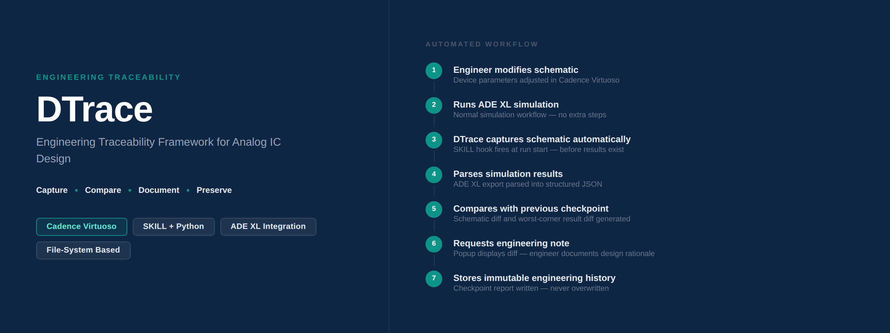
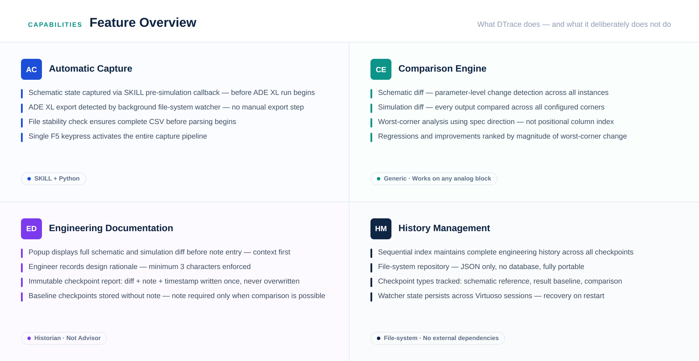

# DTrace

Engineering Traceability Framework for Analog IC Design

DTrace automatically captures schematic snapshots, compares simulation results, records engineering rationale, and builds an immutable design history for Cadence Virtuoso ADE XL using SKILL and Python.

---

## Why DTrace?

Traditional analog design workflows rely heavily on memory.

After dozens of design iterations, engineers often struggle to answer questions like:

- Which transistor sizing caused this improvement?
- When did this regression first appear?
- Which simulation corner became the worst case?
- Why was this compensation capacitor changed?

DTrace automatically records every engineering iteration and builds a permanent design history.

---

## Feature Overview

---

## System Architecture

